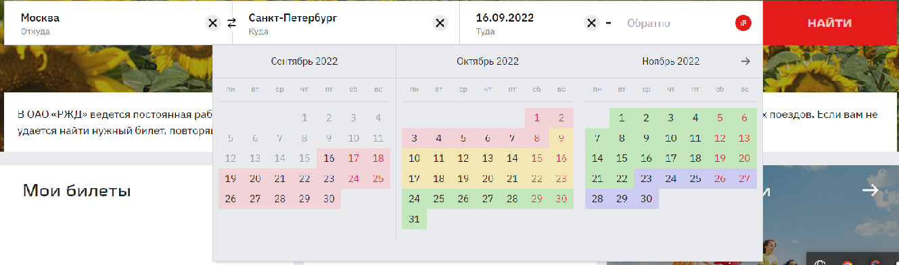

== 2. Выбор даты
[start=3]

Следующий шаг - выбор даты отправления и даты возвращения. При клике на поле "туда", открывается календарь, где требуется выбрать дату отправления. Аналогично производится выбор даты обратного билета в поле "обратно". Выбор даты представлен на рисунке 2.

.Выбор даты
[caption="Рис. 2: "]

_Примечание: если необходим билет только в одну сторону, дату обратного билета в поле "обратно" заполнять не нужно._